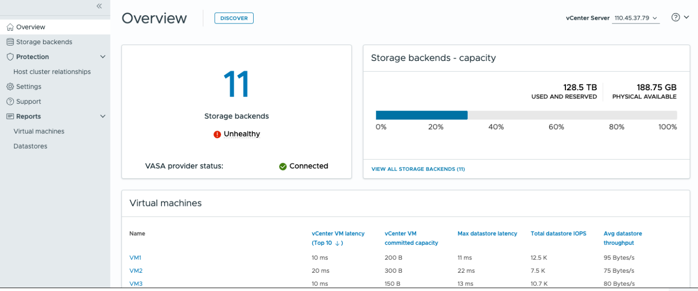

= ONTAP tools for VMware vSphere資訊板概述
:allow-uri-read: 
:icons: font
:imagesdir: ../media/

[role="lead"]
當您在 vCenter 用戶端的捷徑部分中選擇適用ONTAP tools for VMware vSphere外掛程式圖示時，使用者介面將會導覽至概覽頁面。此頁面的作用類似於儀表板，為您提供適用ONTAP tools for VMware vSphere的摘要。

對於增強型連結模式 (ELM) 設置，將出現 vCenter Server 選擇下拉式選單，您可以選擇所需的 vCenter Server 來查看與其相關的資料。此下拉式選單適用於該外掛程式的所有其他清單視圖。在一個頁面中所做的 vCenter Server 選擇將在插件的各個標籤中保留。

從概覽頁面，您可以執行*發現*操作。發現操作在 vCenter 層級執行發現，以偵測任何新新增或更新的儲存後端、主機、資料儲存區和保護狀態/關係。您可以按需執行實體發現，而不必等待預定的發現。

NOTE: 只有當您有執行發現操作的權限時，操作按鈕才會啟用。

提交發現請求後，您可以在最近任務面板中追蹤操作的進度。

儀表板上有幾張卡片，顯示系統的不同元素。下表顯示了不同的卡片及其代表的含義。

|===

| *卡片* | *描述* 

| 地位 | 狀態卡顯示儲存後端的數量以及儲存後端和 VASA 提供者的整體健康狀態。當所有儲存後端狀態正常時，儲存後端狀態顯示*健康*，如果任何一個儲存後端出現問題（未知/無法存取/降級狀態），則顯示*不健康*。選擇工具提示以開啟儲存後端的狀態詳細資訊。您可以選擇任何儲存後端以獲取更多詳細資訊。  *其他 VASA 提供者狀態* 連結顯示在 vCenter Server 中註冊的 VASA 提供者的目前狀態。 

| 儲存後端 - 容量 | 此卡片顯示所選 vCenter Server 執行個體所有儲存後端的已使用容量和可用容量總計。對於ASA r2 儲存系統，由於它是分解式系統，因此不顯示容量資料。 

| 虛擬機 | 此卡片顯示按效能指標排序的前 10 個虛擬機器。您可以選擇標題來取得按升序或降序排列的所選指標的前 10 個虛擬機器。卡片上所做的排序和過濾變更將持續存在，直到您變更或清除瀏覽器快取。 

| 資料儲存 | 此卡片顯示按效能指標排序的前 10 個資料儲存。您可以選擇標題來取得按升序或降序排序的所選指標的前 10 個資料儲存。卡片上所做的排序和過濾變更將持續存在，直到您變更或清除瀏覽器快取。有一個資料儲存類型下拉式選單來選擇資料儲存的類型 - NFS、VMFS 或vVols。 

| ESXi 主機合規性卡 | 此卡片顯示所有 ESXi 主機（針對選定的 vCenter）設定相對於按設定群組/類別建議的NetApp主機設定的整體合規狀態。您可以選擇*應用推薦設定*連結來應用推薦設定。您可以選擇主機的合規狀態來查看主機清單。 
|===