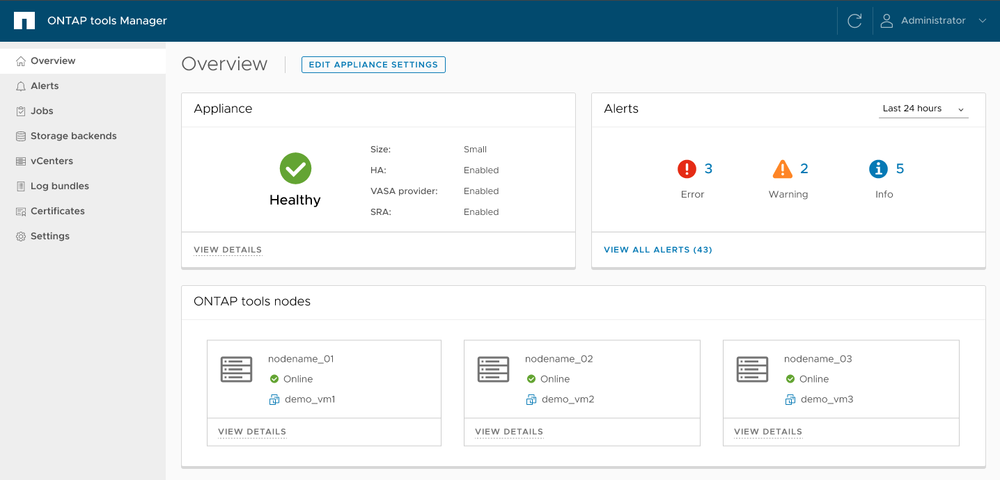

= ONTAP工具管理器使用者介面
:allow-uri-read: 
:icons: font
:imagesdir: ../media/

[role="lead"]
ONTAP tools for VMware vSphere是一個多租用戶系統，可管理多個 vCenter Server 執行個體。  ONTAP工具管理器ONTAP tools for VMware vSphere的更多控制。

ONTAP工具管理器可協助：

* vCenter Server 執行個體管理 - 將 vCenter Server 執行個體新增並管理至ONTAP工具。
* 儲存後端管理 - 將ONTAP儲存叢集新增並管理至ONTAP tools for VMware vSphere，並將其對應至全域已加入的 vCenter Server 執行個體。
* 日誌包下載 - 收集適用於ONTAP tools for VMware vSphere的日誌檔案。
* 證書管理 - 將自簽名證書變更為自訂 CA 證書，並更新或刷新 VASA Provider 和ONTAP工具的所有證書。
* 密碼管理 - 重設使用者的 OVA 應用程式密碼。

若要存取ONTAP工具管理器，請啟動 `\https://<ONTAPtoolsIP>:8443/virtualization/ui/`從瀏覽器並使用您在部署期間提供的適用於ONTAP tools for VMware vSphere管理員憑證登入。

ONTAP工具管理器概述部分有助於管理設備配置，例如服務管理、節點大小升級和高可用性 (HA) 支援。您還可以監控與節點相關的ONTAP工具的整體信息，例如運行狀況、網路詳細資訊和警報。

|===
| *卡片* | *描述* 

| 家電卡 | 設備卡提供ONTAP工具設備的整體狀態。它顯示設備配置詳細資訊和已啟用服務的狀態。有關ONTAP工具設備的更多信息，請選擇“查看詳細信息”連結。當編輯設備設定操作作業正在進行時，設備 portlet 會顯示該作業的狀態和詳細資料。 

| 警報卡 | 警報卡按類型列出ONTAP工具警報，包括 HA 節點級警報。您可以選擇計數文字（超連結）來查看警報列表。該連結將引導您進入按所選類型過濾的警報查看頁面。 

| vCenter | vCenter 卡顯示系統中 vCenter 的健康狀況。 

| 儲存後端 | 儲存後端卡顯示系統中儲存後端的健康狀態。 

| ONTAP工具節點卡 | ONTAP工具節點卡顯示節點列表，包括節點名稱、節點虛擬機器名稱、狀態以及所有網路相關資料。您可以選擇「查看詳細資料」來查看與所選節點相關的其他詳細資訊。 [注意] 在非 HA 設定中，僅顯示一個節點。在 HA 設定中，顯示了三個節點。 
|===