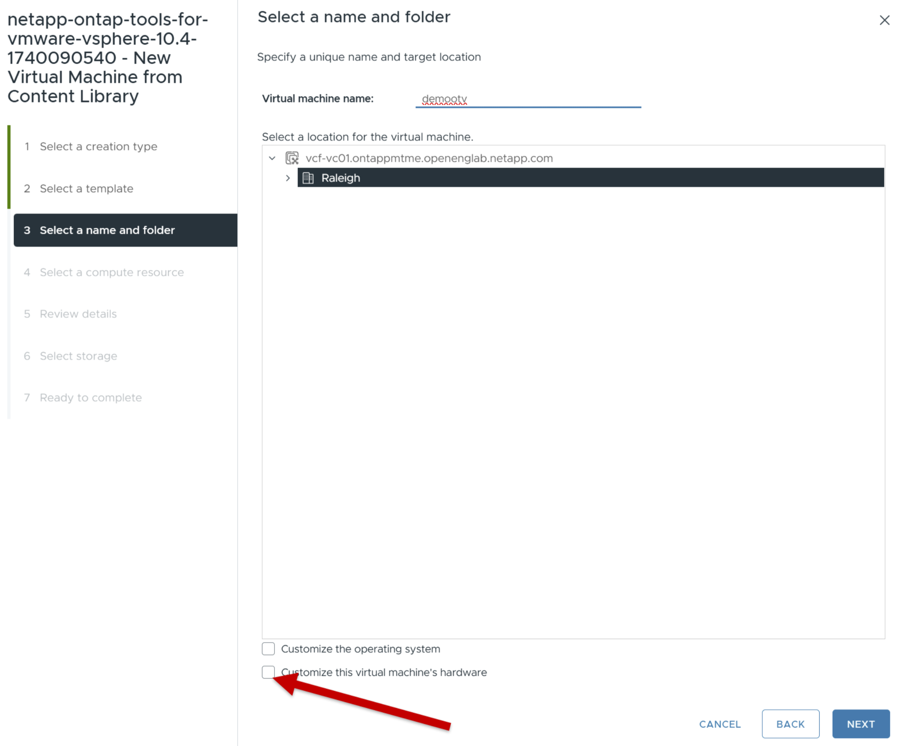
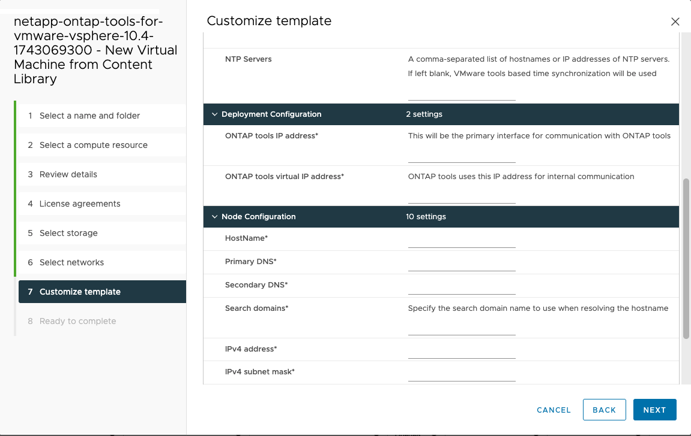
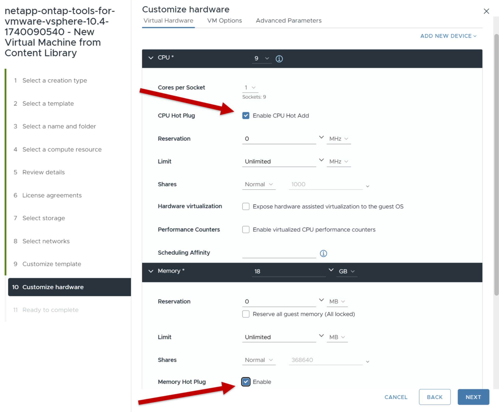

= ONTAP tools for VMware vSphere
:allow-uri-read: 
:icons: font
:imagesdir: ../media/

[role="lead"]
ONTAP tools for VMware vSphere部署為小型單節點，並包含核心服務以支援 NFS 和 VMFS 資料儲存庫。 ONTAPONTAP部署過程最多可能需要 45 分鐘。

.開始之前
VMware 中的內容庫是一個容器對象，用於儲存虛擬機器範本、vApp 範本和其他類型的檔案。使用內容庫進行部署可為您提供無縫體驗，因為它不依賴網路連線。

NOTE: 您應該將內容庫儲存在共用資料儲存體上，以便叢集內的所有主機都可以存取它。在將設備配置為 HA 配置之前，請建立一個內容庫來儲存 OVA。部署後請勿刪除內容庫範本。

NOTE: 為了稍後啟用 HA 部署，請不要直接在 ESXi 主機上部署託管ONTAP工具的虛擬機器。將其部署在叢集或資源池上。

如果您沒有內容庫，請按照以下步驟建立一個：

*建立內容庫* 如果您打算僅使用小型單節點部署，則無需建立內容庫。

. 從下載包含ONTAP tools for VMware vSphere的二進位檔案 (_.ova_) 和簽署憑證的文件 https://mysupport.netapp.com/site/products/all/details/otv10/downloads-tab["NetApp支援站點"^] 。
. 登入 vSphere 用戶端
. 選擇 vSphere 用戶端選單並選擇*內容庫*。
. 選擇頁面右側的*創建*。
. 為庫提供一個名稱並建立內容庫。
. 導航到您創建的內容庫。
. 選擇頁面右側的*操作*，選擇*導入項目*並導入OVA檔。

NOTE: 更多信息，請參閱 https://blogs.vmware.com/vsphere/2020/01/creating-and-using-content-library.html["建立和使用內容庫"]部落格.

NOTE: 在繼續部署之前，請將清單上的叢集分散式資源調度程式 (DRS) 設定為「保守」。這可確保虛擬機器在安裝期間不會被遷移。

ONTAP tools for VMware vSphere最初部署為非 HA 設定。要擴展到 HA 部署，您需要啟用 CPU 熱插拔和記憶體熱插件。您可以將此步驟作為部署程序的一部分執行，也可以在部署後編輯 VM 設定。

.步驟
. 從下載包含ONTAP tools for VMware vSphere的二進位檔案 (_.ova_) 和簽署憑證的文件 https://mysupport.netapp.com/site/products/all/details/otv10/downloads-tab["NetApp支援站點"^] 。如果您已經將OVA匯入內容庫，則可以跳過此步驟，繼續下一步。
. 登入 vSphere 伺服器。
. 導覽至您打算部署 OVA 的資源池、叢集或主機。
+

NOTE: 切勿將ONTAP tools for VMware vSphere儲存在其管理的vVols資料儲存上。

. 您可以從內容庫或本機系統部署 OVA。
+
|===

| 從本地系統 | 來自內容庫 

| a. 右鍵點選並選擇 *部署 OVF 範本...*。 b. 從 URL 中選擇 OVA 檔案或瀏覽到其位置，然後選擇 *下一步*。 | a. 前往您的內容庫並選擇要部署的庫專案。 b. 選擇“操作”>“從此範本新虛擬機器” 
|===
. 在*選擇名稱和資料夾*欄位中，輸入虛擬機器名稱並選擇其位置。
+
** 如果您使用的是 vCenter Server 8.0.3 版本，請選擇選項 *自訂此虛擬機器的硬體*，這將在進入 *準備完成* 視窗之前啟動名為 *自訂硬體* 的附加步驟。
** 如果您使用的是 vCenter Server 7.0.3 版本，請依照部署結束時的*下一步是什麼？ *部分中的步驟進行操作。

. 選擇電腦資源並選擇*下一步*。或者，選取「*自動啟動已部署的虛擬機器*」複選框。
. 查看範本的詳細資訊並選擇*下一步*。
. 閱讀並接受許可協議，然後選擇*下一步*。
. 選擇配置的儲存和磁碟格式，然後選擇*下一步*。
. 為每個來源網路選擇目標網絡，然後選擇*下一步*。
. 在*自訂範本*視窗中，填寫必填欄位並選擇*下一步*。
+
** 該資訊在安裝期間進行驗證。如果存在差異，Web 控制台上會出現錯誤訊息，並提示您進行修正。
** 主機名稱必須包含字母（AZ、az）、數字（0-9）和連字號（-）。若要設定雙棧，請指定對應到 IPv6 位址的主機名稱。
+

NOTE: 不支援純 IPv6。包含 IPv6 和 IPv4 位址的 VLAN 支援混合模式。

** ONTAP工具 IP 位址是與ONTAP工具通訊的主要介面。
** IPv4 是節點配置的 IP 位址元件，可用於在節點上啟用診斷 shell 和 SSH 訪問，以進行偵錯和維護。

. 使用 vCenter Server 8.0.3 版本時，在 *自訂硬體* 視窗中，啟用 *CPU 熱添加* 和 *記憶體熱插拔* 選項以允許 HA 功能。
. 查看“準備完成”視窗中的詳細信息，選擇“完成”。
+
隨著部署任務的創建，進度將顯示在 vSphere 工作列中。

. 如果未選擇自動啟動虛擬機器的選項，則完成任務後啟動虛擬機器。

您可以在 VM 的 Web 控制台中追蹤安裝進度。

如果 OVF 表格有差異，則會出現一個對話方塊提示採取糾正措施。使用標籤按鈕進行導航，進行必要的更改，然後選擇*確定*。您有三次機會來解決任何問題。如果三次嘗試後問題仍然存在，安裝過程將停止，建議在新的虛擬機器上重新嘗試安裝。

.下一步是什麼？
如果您已使用 vCenter Server 7.0.3 為ONTAP tools for VMware vSphere，請在部署後執行下列步驟。

. 登入 vCenter 用戶端
. 關閉ONTAP工具節點。
. 導覽至 *Inventories* 下的ONTAP tools for VMware vSphere並選擇 *Edit settings* 選項。
. 在 *CPU* 選項下，選取 *啟用 CPU 熱添加* 複選框
. 在*記憶體*選項下，選取*記憶體熱插拔*對應的*啟用*複選框。

