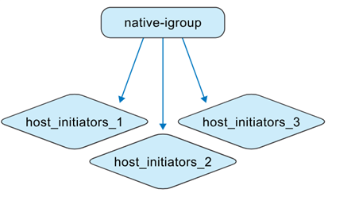
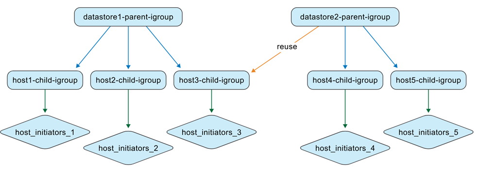
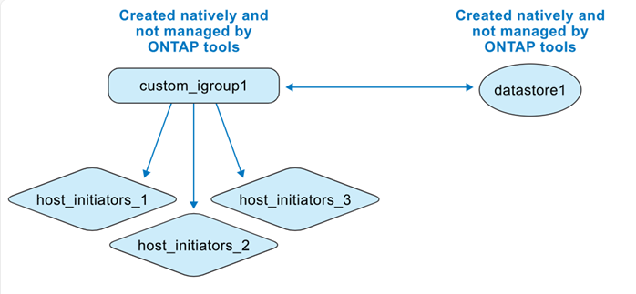
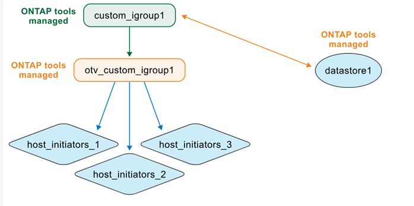

= 了解ONTAP工具管理的 igroup
:allow-uri-read: 
:icons: font
:imagesdir: ../media/

[role="lead"]
在管理ONTAP工具虛擬機器和ONTAP儲存系統時，了解 igroup 行為至關重要，尤其是在將資料儲存從非ONTAP工具環境遷移到ONTAP工具管理時。本節介紹在此轉換過程中如何更新 igroup。

ONTAP tools for VMware vSphere透過在 VMware 資料中心環境中自動建立和維護ONTAP和 vCenter 物件來簡化資料儲存區管理。

ONTAP tools for VMware vSphere在兩種不同的上下文中解釋 igroup：

.非ONTAP工具管理的 igroup
作為儲存管理員，您可以在ONTAP系統上將 igroup 建立為平面或巢狀結構。該圖顯示了在ONTAP系統中建立的平面 igroup。

.ONTAP工具管理的 igroup
建立資料儲存庫時，ONTAP tools for VMware vSphere會自動使用巢狀結構建立 igroup，以便更輕鬆地進行 LUN 對應。

例如，當在主機 1、2 和 3 上建立並掛載 datastore1，並在主機 3、4 和 5 上建立並掛載新的 datastore（datastore2）時， ONTAP工具會重複使用主機級 igroup 以實現高效管理。

image:../media/otv-managed.png["ONTAP工具管理的 igroup"]

以下是適用於ONTAP tools for VMware vSphere的一些案例。

*當您使用預設 igroup 設定建立資料儲存體時*

當您建立資料儲存庫並將 igroup 欄位留空（預設）時， ONTAP工具會自動為該資料儲存庫產生嵌套的 igroup 結構。資料儲存層級的父 igroup 使用下列模式命名：otv_<vcguid>_<host_parent_datacenterMoref>_<datastore_name>。每個主機級子 igroup 遵循以下模式：otv_<hostMoref>_<vcguid>。您可以在ONTAP儲存介面的 *Parent Initiator Group* 部分中查看父 (資料儲存層級) igroup 和子 (主機層級) igroup 之間的關聯。

使用嵌套 igroup 方法，LUN 僅對應到子 igroup。然後，vCenter Server 清單將顯示新的資料儲存。

*當您使用自訂 igroup 名稱建立資料儲存空間時*

在ONTAP工具中建立資料儲存區時，您可以輸入自訂 igroup 名稱，而不是從下拉清單中選擇。然後， ONTAP工具會使用您指定的名稱在資料儲存層級建立一個父 igroup。如果相同主機用於多個資料存儲，則會重複使用現有的主機級（子）igroup。因此，新資料儲存區的 LUN 將對應到此現有子 igroup，該子 igroup 現在可能與多個父 igroup 相關聯（每個資料儲存區一個）。vCenter Server 使用者介面資料儲存清單確認已成功建立具有自訂 igroup 名稱的新資料儲存體。

*在建立資料儲存區期間重複使用 igroup 名稱時*

使用ONTAP工具使用者介面建立資料儲存庫時，您可以從下拉清單中選擇現有的自訂父 igroup。重新使用父 igroup 建立另一個資料儲存庫後， ONTAP系統使用者介面會顯示此關聯。新的資料儲存區也會出現在 vCenter Server 使用者介面中。

此操作也可以使用 API 執行。若要在資料儲存體建立期間重複使用現有的 igroup，請在 API 請求有效負載中指定 igroup UUID。

*當您從ONTAP和 vCenter 本地建立資料儲存區和 igroup 時*

如果您直接在ONTAP系統和 VMware 環境中建立 igroup 和資料存儲， ONTAP工具首先不會管理這些物件。這將建立一個扁平的 igroup 結構。

若要使用ONTAP工具管理現有資料儲存庫和 igroup，您應該執行資料儲存庫發現。ONTAP工具識別並註冊資料儲存和 igroup，並將它們轉換為資料庫中的巢狀結構。使用自訂名稱建立新的父 igroup，同時使用「otv_」前綴重命名現有 igroup 並成為子 igroup。啟動器映射保持不變。僅對應到資料儲存區的 igroup 在發現過程中進行轉換。此後，igroup 結構如下圖所示。

您可以直接在 vCenter Server 中建立資料儲存庫，然後將其納入ONTAP工具管理。首先，在ONTAP系統中建立一個平面 igroup 並將 LUN 對應到它。在ONTAP工具中執行資料儲存發現後，平面 igroup 將轉換為巢狀結構。然後， ONTAP工具會管理 igroup，並使用「otv_」前綴對其進行重新命名。在此過程中，LUN 仍然對應到同一個 igroup。

ONTAP工具如何重複使用本機所建立的 igroup

您可以使用最初在ONTAP系統中建立的 igroup 在ONTAP工具中設定資料儲存庫，然後由ONTAP工具進行管理。這些 igroup 出現在自訂啟動器群組名稱下拉清單中。然後，資料儲存區的新 LUN 將會對應到對應的規範化子 igroup，例如「otv_NativeIgroup1」。

ONTAP tools for VMware vSphere不會偵測或使用在ONTAP系統中建立的、未由ONTAP工具管理或未連結到資料儲存的 igroup。
