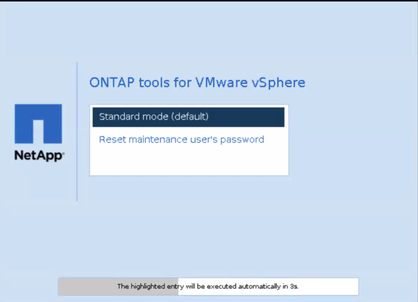

= 重設維護控制台使用者密碼
:allow-uri-read: 
:icons: font
:imagesdir: ../media/

[role="lead"]
在用戶機作業系統重新啟動操作期間，grub 選單會顯示一個用於重設維護控制台使用者密碼的選項。此選項用於更新對應虛擬機器上現有的維護控制台使用者密碼。重置密碼完成後，虛擬機器將重新啟動以設定新密碼。在高可用性部署方案中，虛擬機器重新啟動後，其他兩台虛擬機器上的密碼會自動更新。

NOTE: 對於ONTAP tools for VMware vSphere，您應該變更第一個節點（即 node1）上的維護控制台使用者密碼。

.步驟
. 登入您的 vCenter Server
. 右鍵單擊虛擬機器並選擇*電源*>*重新啟動客戶作業系統*在系統重新啟動期間，您將看到以下畫面：
+
您有 5 秒鐘的時間來選擇您的選項。按任意鍵停止進程並凍結 GRUB 選單。

. 選擇*重設維護使用者的密碼*選項。維護控制台開啟。
. 在控制台中，輸入新的密碼詳細資料。新密碼和重新輸入的新密碼詳細資訊應符合才能成功重設密碼。您有三次機會輸入正確的密碼。成功輸入新密碼後系統重新啟動。
. 按 Enter 鍵繼續。密碼已在虛擬機器上更新。

NOTE: 啟動虛擬機器時也會出現相同的 GRUB 選單。但是，您應該僅將重設密碼選項與*重新啟動客戶作業系統*選項一起使用。
