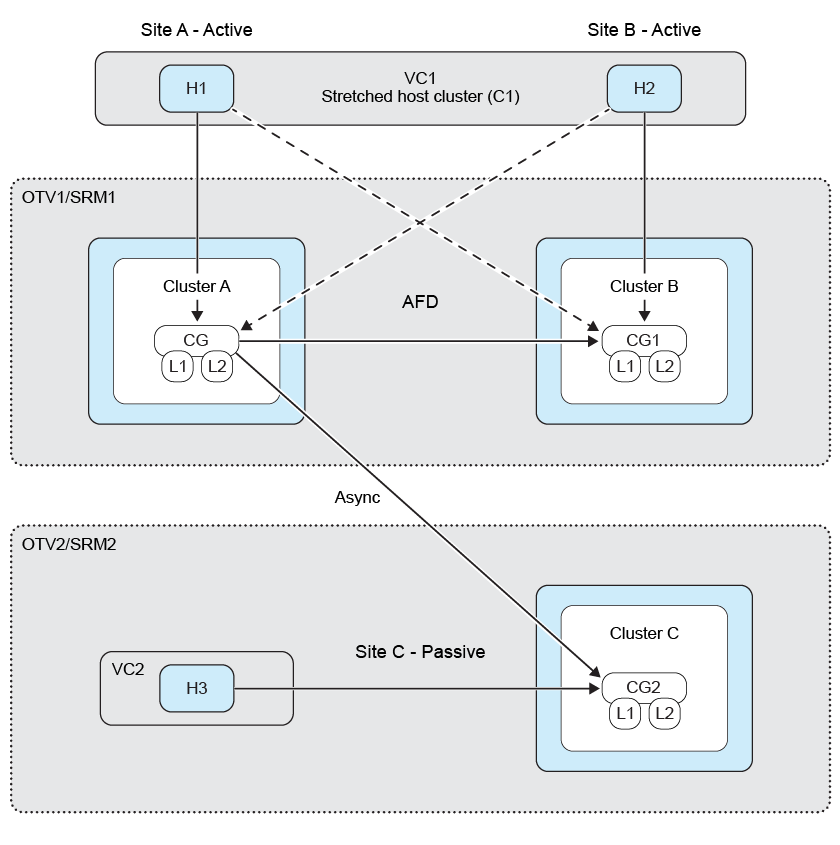
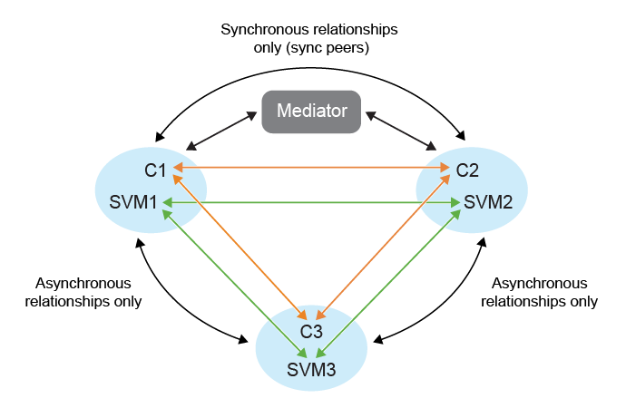

= 扇出保護
:allow-uri-read: 
:icons: font
:imagesdir: ../media/

[role="lead"]
在扇出保護中，一致性組受到雙重保護，在第一個目標ONTAP集群上具有同步關係，在第二個目標ONTAP集群上具有非同步關係。建立、編輯和刪除SnapMirror主動同步保護工作流程維護同步保護。  SRM 故障轉移和重新保護工作流程維持非同步保護。

為了建立扇出保護，您需要對等三個站點叢集和 SVM。

範例：

|===

| 如果 | 然後 

 a| 
* 來源一致性群組位於叢集 c1 和 SVM svm1 上
* 第一個目標一致性群組位於叢集 c2 和 SVM svm2 上，並且
* 第二個目標一致性群組位於叢集 c3 和 SVM svm3 上

 a| 
* 源ONTAP集群上的集群對等將是 (C1, C2) 和 (C1, C3)。
* 第一個目標ONTAP集群上的集群對等將是 (C2, C1) 和 (C2, C3)，並且
* 第二個目標ONTAP集群上的集群對等將是 (C3, C1) 和 (C3, C2)。
* 來源 SVM 上的 SVM 對等將是 (svm1, svm2) 和 (svm1, svm3)。
* 第一個目標 SVM 上的 SVM 對等將是 (svm2, svm1) 和 (svm2, svm3) 並且
* 第二個目標 svm 上的 SVM 對等將是 (svm3, svm1) 和 (svm3, svm2)。

|===
下圖顯示了扇出保護配置： 

*步驟*

. 建立一個新的佔位符資料儲存。參考 https://techdocs.broadcom.com/us/en/vmware-cis/live-recovery/site-recovery-manager/8-8/site-recovery-manager-administration-8-8/about-placeholder-virtual-machines/configure-a-placeholder-datastore.html["選擇佔位資料存儲"]
. 將資料儲存新增至主機叢集保護link:../manage/edit-hostcluster-protection.html["修改受保護的主機集群"]。您需要新增非同步和同步策略類型。

